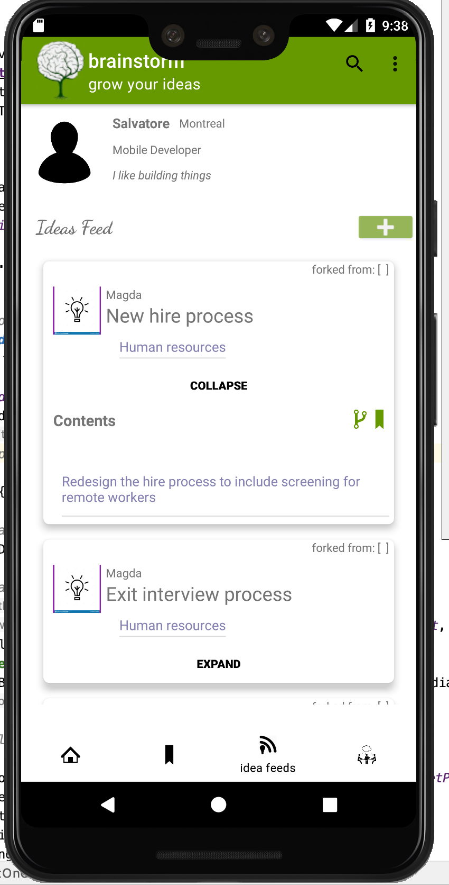
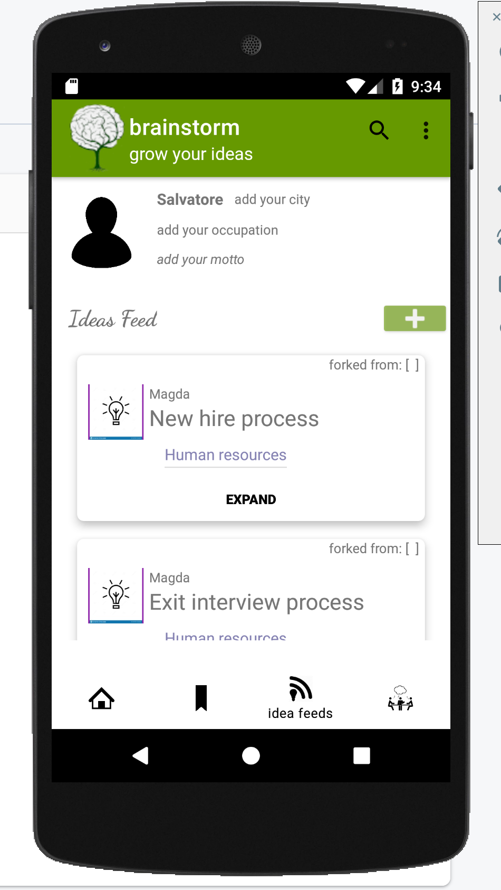

# Brainstorm - grow you ideas

Brainstorm it's an application for android written in kotlin and use Firebase real time database for the backend. 

**What's is Brainstorm?**
it's a platform for brainstorm ideas. Yuo got an idea tha you would like develop? Yuo can make public and find people interest to collaborate thta can fork it and elaborate, or you can set it private and work together with your team.

**Screenshot**

**Firebase DB**

